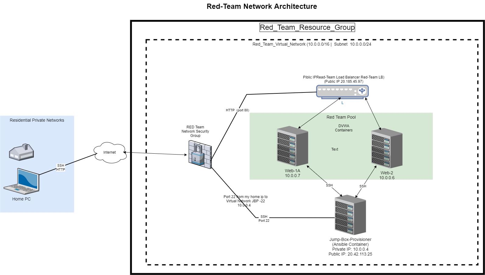

# Steven-ELK-Stack-Week13
Repository for Documentation, scripts, diagrams for ELK Stack Project.  The goal of this project is to  generate a live ELK deployment on Azure
The source files located in this repository were used to configure the network depicted below.

These files have been tested and used to generate a live ELK deployment on Azure. They can be used to either recreate the entire deployment pictured above. Alternatively, select portions of the specific YAML configuration file may be used to install only certain pieces of it, such as Filebeat. 
[YAML Configuration file](Ansible/filebeat-config.yml)

This document contains the following details:
- Description of the Network Topology I created
- Access Policies
- ELK Configuration
  - Beats in Use (Filebeat / Metricbeat)
  - Virtual Machines Being Monitored
- How to Use the Ansible Build

### Description of the Topology

The main purpose of this network is to expose a load-balanced and monitored instance of DVWA, the D*mn Vulnerable Web Application.

Load balancing ensures that the application will be highly available and less vulnerable to Denial of Service attack(s), in addition to restricting access to the network to prevent unauthorized access.
- _Load balancers not only manage traffic flow to ensure better response to client request(s), but also help to protect servers from DDOS attacks. The advantage of having a "jump box" is that it provides a segregation layer between local infrastructure and the internet. With the jumb box in place there is no way of directly connecting to the application servers (backend pool).  Additionally this architecture allows the network to harden a specific point (i.e., the jump box) and make that a point to harden rather then having to harden every piece of equiptment on the network._

Integrating an ELK server allows users to easily monitor the vulnerable VMs for changes to the Logs and system traffic.
- _Filebeat when installed watchs for and logs events that affect the network such as updates to data, access by specific entities._
- _Metricbeat when installed logs and records statistics of the system such as response time, number of access, downtime._

The configuration details of each machine may be found below.
_Note: Use the [Markdown Table Generator](http://www.tablesgenerator.com/markdown_tables) to add/remove values from the table_.

| Name     | Function | IP Address | Operating System |
|----------|----------|------------|------------------|
| Jump Box | Gateway  | 10.0.0.1   | Linux            |
| WEB 1-A  | Backend  | 10.0.0.7   | Linux            |
| WEB 2    | Backend  | 10.0.0.6   | Linux            |
| ELK      | Analytics| 10.1.0.4   | Linux            |

### Access Policies

The machines on the internal network are not exposed to the public Internet. 

Only the JumpBox machine can accept connections from the Internet. Access to this machine is only allowed from the following IP addresses (my private workstation):
- _TODO: Add whitelisted IP addresses_

Machines within the network can only be accessed by SSH.
- The only machine that is able to connect to ELK VM is Jump Box from private IP Address 10.0.0.4_

A summary of the access policies in place can be found in the table below.

| Name     | Publicly Accessible | Allowed IP Addresses |
|----------|---------------------|----------------------|
| Jump Box | Yes                 | Private Workstation  |
| Web1A    | No                  | 10.0.0.4             |
| WEB2     | No                  | 10.0.0.4             |  
| ELK      | No                  | 10.0.0.4             |

### Elk Configuration

Ansible was used to automate configuration of the ELK machine. No configuration was performed manually, which is advantageous because it ensure consistency for future deployment of the same configurations as well as updates can be done in one central location and then copied out for both efficiency and consistency.

The playbook implements the following tasks:
- Installs the Docker container/engine
- Increases the virtual memory of that VM to ensure that Docker will work properly
- Downloads and install the Docker ELK container
- Configures the ports that the ELK stack will use
- Tells the VM that Docker services will always start on boot of the VM. 

The following screenshot displays the result of running `docker ps` after successfully configuring the ELK instance.

### Target Machines & Beats
This ELK server is configured to monitor the following machines:
- 10.0.0.6 > WEB2
- 10.0.0.7 > WEB1A

We have installed the following Beats on these machines:
- Filebeat-7.6.1-amd64.deb
- metricbeat-7.6.1-amd64.deb 

These Beats allow us to collect the following information from each machine:
- Filebeat is a lightweight shipper for forwarding and centralizing log data. Filebeat monitors log files or locations specified during configuration, collects and log events, and forwards them either to Elasticsearch or Logstash for indexing/storage.
Metricbeat collects metrics from the operating system and from services (tagged for monitoring) running on the server. Metricbeat then takes the colected metrics and statistics and outputs it to a pre-specified location for storage._

### Using the Playbook
In order to use the playbook, you will need to have an Ansible control node already configured. Assuming you have such a control node provisioned: 

SSH into the control node and follow the steps below:
- Copy the filebeat-config.yml and metricbeat-config.yml file to the /etc/ansible/roles/files/ directory.
- Update the configuration file to include the private IP of the ELK server to the ElasticSearch and Kibana sections of the configuration file.
- Run the playbook, and navigate to ELK server to check that the installation worked as expected.
- The ansible playbook file is called install-elk.yml
- To make Ansible run the playbook on a specific machine hosts file in ansible directory should be updated with the name of the machine and its IP address, the name of the machine should match the hosts key value in the playbook, so that Ansible can correctly map the playbook to the server.
- Navigate the following URL http://52.252.131.6:5601/ to check that the ELK server installation is working as expected, where 52.252.131.6 is the public IP address of the ELK server.

_The commands needed to run the Ansible configuration for the Elk-Server are:

ssh azadmin@20.42.113.25
(type in the password for azadmin)
sudo docker ps -a
sudo docker start container (name of the container)
sudo docker attach container (name of the container)
cd /etc/ansible/ (this is where the YML scripts and playbooks are located on the container)
ansible-playbook install-elk.yml
cd /etc/ansible/roles/
### NOTE: Ensure all files are properly placed before running the ansible-playbooks._
ansible-playbook filebeat-playbook.yml
ansible-playbook metricbeat-playbook.yml
navigate http://52.252.131.6:5601/
